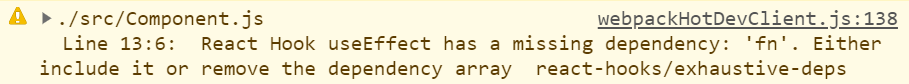

> Hooks는 React v16.8 에 도입된 기능으로, 상태 관리와 같은 다양한 기능들을 함수형 컴포넌트에서도 사용할 수 있게 해준다.
> 자주 사용하는 공용 로직의 경우, Custom Hook을 작성하여 재사용을 쉽게 할 수 있다.
> ( 참고 : [공식 홈페이지](https://ko.reactjs.org/docs/hooks-intro.html) )

### useEffect === 생명 주기 ?

`useEffect` 는 기본적으로 제공되는 훅 중에 하나로, 컴포넌트의 사이드 이펙트를 관리할 수 있다.

공식 문서에서는, 클래스 컴포넌트에 익숙하다면 `componentDidMount`, `componentDidUpdate`, `componentWillUnmount` 가 합쳐진 것으로 생각해도 좋다고 한다.

많은 훅 관련 글에서도 역시, `useEffect` 를 주로 세 생명 주기 함수와 연관지어서 설명한다.

훅에 익숙하지 않은 한 개발자가 있다. 개발자는 어떤 컴포넌트를 작성하면서, 위 설명들을 보고 사용법을 익혀, 마운트 시점에서만 동작할 로직을 `useEffect` 내부에 작성했다.

```js
function Component() {
  ...
  useEffect( () => {
    ...
  }, []);
  ...
}
```

이후 `useEffect` 내부 로직에 `props.data`를 추가로 사용해야 하고, 로직을 외부에서도 실행 가능해야 했다. 그래서 해당 로직을 함수로 작성하고, **"이 함수는 마운트 시점에만 호출되어야 해!"** 라는 의도로 코드를 아래와 같이 수정하였다.

```js
function Component({data}) {
  ...
  const fn = useCallback( () => {
    ...
  }, [data]);

  useEffect( () => {
    fn();
  }, []);
  ...
}
```

함수가 마운트 시점에만 호출되고, 의도대로 동작하는 코드를 작성하여 기뻐하지만, 곧 다음과 같은 메세지를 마주친다.



코드가 잘 동작함에도 출력되는 warning에 묘한 기분을 느끼며, 메세지를 제거하기 위해 여기저기 수정을 해본다.
간단한 수정으로 메세지가 사라진다면 정말 좋겠지만, 고칠 방법이 떠오르지 않거나 잘 작동하는 코드를 수정하는데에 점차 실증을 느낀다.

결국, 메세지가 출력되도 못 본 척 하거나, 메세지의 원인인 코드의 위에 조심스레 주석을 작성한다.

```js
// eslint-disable-next-line react-hooks/exhaustive-deps
```

### 왜? 잘 돌아가잖아?

맞다. 잘 돌아간다. 앞서 설명한 사례에서 개발자가 충분한 확신을 가지고 개발을 했다면, 눈에 보이는 오류는 없을 것이다. 그저 원하는대로 잘 돌아가는 코드와, 문법(eslint) 관련 warning 메세지만 있다. 그마저도 eslint를 비활성화 하면 오롯이 코드만 남는다.

그럼에도 해당 사례를 굳이 왜 들고왔냐면, 의존성을 속이고 코드를 작성하는 대부분의 개발자는 `useEffect` 를 잘못 이해하고 있을 확률이 높기 때문이다.

잘못 이해하고 있는 개발자는, 당연하게도 클린업(cleanup)을 `componentWillUnmount` 로만 이해하고 있을 것이다. ~~( 실제로 그렇게 알고 있는 사람을 봤다. )~~ 그래서 아마, 언마운트 시점에 `fn` 을 호출하려고 할 때에는 아래와 같이 작성할 것이다.

```js
function Component({data}) {
  ...
  const fn = useCallback( () => {
    ...
  }, [data]);

  useEffect( () => {
    return fn;
  }, []);
  ...
}
```

당연하게도, 컴포넌트가 마운트-언마운트 되는동안 `deps` 값이 한번이라도 바뀌었다면, 대부분 의도한대로 동작하지 않을 것이다. `fn` 은 `deps` 의 값이 변경될 때마다 새로 정의되는데, `useEffect` 는 `fn` 이 재정의 되었는지 알지 못한다. 그래서, 언마운트 시점엔, 처음 선언되었던 `fn`을 호출할 것이다.

의존성에 `fn`을 명시하더라도, 의도와는 다르게 `fn` 이 재정의 될 때마다 호출되어, 머리가 아프기 시작한다. 결국 개발자는 구글에게 물어보고, 이것 저것 시도해보며 고통을 받을 것이다.

### useEffect

글의 처음에서도 말했듯이, 여러 훅 관련 글에서도 생명 주기에 빗대어 표현한다. 공식 문서 역시, 생명 주기 함수 세 개가 합쳐진 것으로 생각해도 좋다고 적혀있다. 그래서 훅에 익숙하지 않는 개발자는, 생명 주기에 집착하며 `useEffect` 를 사용한다.

물론, 의존성이 없을 경우에는, `useEffect`에 빈 배열을 전달하여 `componentDidMount`, `componentWillUnmount`기능을 구현할 수는 있다. 하지만 위에서 예를 들었던 첫 번째 상황은, `useEffect` 에게 의존성을 속여서 의도대로 돌아가는 것 처럼 보일 뿐이다.

공식 문서의 `useEffect` 파트에서, 생명 주기 외에도 자주 등장하는 키워드가 있다. 바로 `side effects`(effect) 이다. 이팩트가 뭘까? 설명하기에 앞서, 우선 다음 코드를 보자.

```js
const [count, setCount] = useState(0);

useEffect( () => {
  const id = setInterval( () => setCount( prev => prev + 1 ), 1000);
  return () => clearInterval(id);
}, []);

useEffect( () => {
  console.log('a', count);
  return () => console.log('b', count);
}, [count]);
```

해당 코드는 1초마다 카운트를 증가시키고, 카운트가 변경될 때 마다 카운트를 출력한다. 이 로직을 가진 컴포넌트가 카운트를 두번 증가시키고 언마운트 되었을때, 아래와 같이 출력된다.

```
a 0
b 0
a 1
b 1
a 2
b 2
```


